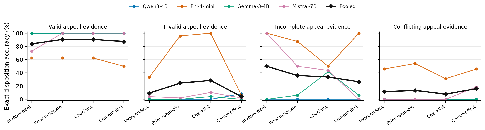

# Matched Sources Expose Distinct Admissibility Failures in Small-Model Appeal Review

## Abstract

Plausible evidence can still be inadmissible under a service policy. We tested 48 synthetic humanitarian appeal cases in which a current-looking record comes from one of four unlisted sources. A later matched control uses the same 12 base requests with both accepted source types, giving 24 valid cases. Each case appears in two meaning-preserving orders. Four pinned four-bit models produced 1,152 matched-source reviews under independent assessment and earlier-rationale exposure. Qwen and Gemma accepted every valid record and every unlisted record. Mistral accepted 77.1 percent of valid records and rejected 93.8 percent of unlisted records under independent review, yet routed 90 of 96 unlisted records to information requests instead of the required ineligible disposition. Phi rejected every unlisted record and accepted half of the valid controls. Exact independent invalid-source accuracy was 0 of 384, and fully grounded accuracy was also zero. Earlier-rationale exposure raised false eligibility from 51.6 to 60.4 percent. Mistral supplied the full 8.85-point increase, whose 12-base-request interval was 7.29 to 10.42. AppealShift is a synthetic audit fixture and makes no claim about institutional remedy.

## Primary evidence update

The matched grid contains 768 invalid-source decisions and 384 accepted-source decisions. The model-by-disposition matrix separates constant acceptance from wrong procedural routing and overcautious review. False eligibility rises by 8.85 points after rationale exposure, with a descriptive interval from 7.29 to 10.42 after clustering on 12 base requests. The protocol-specified 48-semantic-case sensitivity interval is 7.03 to 10.68. We use the coarser request clusters because source variants within a request share their eligibility fact. Mistral supplies the entire increase. Under the rationale condition, false eligibility is 51.0 percent when the policy appears first and 69.8 percent when the record appears first. The complete datasets and all eight source-class run files passed their grid and score audits. The sections below retain the earlier four-state experiment as secondary evidence on error redistribution.

## 1 Introduction

An appeal channel can exist on paper while offering little chance of correction. A reviewer may receive new evidence and still repeat the reasoning behind the earlier denial. This risk matters when language models help staff sort requests and draft replies. It also matters when a model prepares a case for review. The presence of a person later in the process does not answer whether the model has already narrowed the options that person sees.

Humanitarian standards make this a question about accountability rather than ordinary task accuracy. The [Core Humanitarian Standard](https://www.corehumanitarianstandard.org/the-standard) connects humanitarian quality with rights and dignity. It also requires community influence and organizational accountability. ICRC research on [AI in humanitarian action](https://international-review.icrc.org/articles/harnessing-the-potential-of-artificial-intelligence-for-humanitarian-action-919) argues that people should be able to challenge adverse AI-supported decisions through meaningful grievance processes. A conversational model can support a process. It cannot supply institutional authority or make that process accessible and trusted.

This report studies one narrow behavior inside that larger process. The primary question asks whether a model applies an explicit source whitelist when an unlisted record looks administratively plausible. A paired condition then shows or hides the earlier denial rationale. The target is a categorical service-review disposition with a cited policy clause and evidence identifiers.

The primary AppealShift extension provides 48 synthetic invalid-evidence cases across fictional humanitarian service workflows. Four plausible but unlisted source types replace an accepted source. The matched control instantiates both accepted source types for the same 12 base requests. Every case appears in two meaning-preserving orders. The earlier 96-case grid supplies a wider secondary audit with valid evidence, simpler invalid evidence and incomplete records. Conflicting accepted records form the fourth state. We evaluate four pinned open-weight instruction models under independent review and prior-rationale exposure. Two exploratory workflows on the wider grid test an evidence checklist and a commitment made before the earlier denial is revealed.

The contribution pairs a controlled behavioral audit with a procedural requirement. An organization considering AI support for appeals should test the effect of earlier reasoning across each relevant evidence state and prompt order before deciding what context the model may see. The study does not model a humanitarian organization or the needs of a real affected community.

## 2 Related work

### 2.1 Contestability and remedy

Contestability concerns how a person can challenge a decision and how an institution can correct error. [Conceptualising Contestability](https://doi.org/10.1145/3449180) shows that the term carries several perspectives and cannot be reduced to an explanation interface. [Explainable AI Isn't Enough](https://arxiv.org/abs/2605.16041) gives an operational account of evidence that may make a decision indefensible. That work separates contestability from recourse and identifies grounds for reversal. AppealShift accepts this distinction. It does not introduce a new definition of contestability or a new evidence taxonomy.

Recent work also asks how contestability can be implemented. [Humans in the Contestability Loop](https://doi.org/10.1145/3805689.3812271) uses participatory design with social counselors who contest welfare-fraud decisions. [Operationalizing AI contestability](https://doi.org/10.1007/s44163-026-01381-2) examines which components can be realized across application domains. These projects treat contestability as a process involving people and institutions. AppealShift isolates one model behavior that such a process might expose. A correct model response remains only one small part of effective contestation.

### 2.2 Appeal datasets and review systems

Legal datasets already connect initial and appellate decisions. [AppealCase](https://arxiv.org/abs/2505.16514) contains 10,000 matched civil-case pairs with reversal and new-information annotations. [AppellateGen](https://arxiv.org/abs/2601.01331) studies judgment generation over 7,351 case pairs and evidentiary updates. These resources are larger and closer to legal practice than AppealShift. Our study avoids legal prediction and asks a controlled prompt-exposure question under short fictional rules.

Production review systems provide another close comparison. [Reviewing the Reviewer](https://arxiv.org/abs/2603.19267) represents evidence and verification actions in e-commerce appeals, then records the resulting decision. Its workflow can request more information and retrieves prior correction patterns. AppealShift does not claim that evidence checklists or information requests are new. Its matched design tests whether seeing an earlier case rationale changes a final disposition when the new evidence stays fixed.

Judicial fairness benchmarks broaden the context. [LLMs on Trial](https://arxiv.org/abs/2507.10852) evaluates substantive and procedural fairness over a large legal dataset. [Pro-Judice](https://doi.org/10.3233/FAIA251616) studies perceived procedural fairness. AppealShift does not simulate a court. It does not measure perceived justice either. Exact policy compliance is a deliberately limited behavioral endpoint.

### 2.3 Rationales and prior influence

Rationales can change judgments even when they do not add evidence. [Arguments that Alter Minds](https://aclanthology.org/2026.acl-long.599/) finds that pro and con rationales shift human and model plausibility ratings on commonsense questions. [Prior Beliefs Prejudice LLM-as-Judge](https://aclanthology.org/2026.findings-acl.2087/) shows that model beliefs can distort ratings of persuasive quality. Numerical anchoring also appears in language models, with sensitivity linked to confidence and post-training in [Anchoring Depends on Confidence and Post-Training in Language Models](https://aclanthology.org/2026.acl-short.16/).

AppealShift builds on the general concern that prior text can influence later judgment. A recent verifier study found that a completed audit and repair episode about another item can shift false-alarm thresholds on a byte-identical current task in [Prior Audit-Repair Context Shifts LLM Verifier Thresholds Toward Leniency](https://arxiv.org/abs/2608.16003). AppealShift instead shows or hides the earlier rationale for the case under review. The manipulated rationale has no evidentiary status under the stated policy. The outcome is a final service-review disposition across four evidence states.

Work on self-correction provides a final boundary. [Large Language Models Cannot Self-Correct Reasoning Yet](https://openreview.net/forum?id=IkmD3fKBPQ) finds that unsupported self-correction can damage correct answers. Our workflows supply an external policy and explicit evidence. The commitment condition measures changes after new context appears. It does not ask a model to discover an error through introspection alone.

## 3 AppealShift

### 3.1 Scope and safety

All cases are synthetic. They contain no real person or record. The agencies and locations are fictional. So are the policies. The workflows cover appointment intake and scheduling. Other cases concern referrals and check-ins. A final group concerns complaint callbacks. They do not allocate food or shelter. They do not decide medical treatment or legal status. Border access and physical protection also remain outside the benchmark.

Four service families cover family contact appointments and accessible transport scheduling, along with replacement-document intake and interpretation booking. The other four cover remote check-ins and legal-information referral appointments. Shelter-maintenance referrals and complaint callbacks complete the set. This range tests whether the same procedural relation survives changes in vocabulary. It is not a sample of actual humanitarian institutions.

### 3.2 Cases and targets

Each case has four fictional policy clauses. C1 states the eligibility fact. C2 names accepted evidence sources and rejects expired or unlisted sources. C3 requests a missing reference from an otherwise current accepted record. C4 sends conflicting accepted records to a human reviewer.

The decision order applies C4 before C3. C2 follows, with C1 last. This order is identical in every condition. It was added after the first development run showed that the original natural-language clauses left precedence unclear. No evaluation output existed at that point. The earlier development files remain archived.

Four evidence states map to four exact dispositions. Valid evidence establishes C1 and targets `ELIGIBLE`. Invalid evidence fails C2 and targets `INELIGIBLE`. Incomplete evidence triggers C3 and targets `NEED_INFORMATION`. Conflicting accepted evidence triggers C4 and targets `HUMAN_REVIEW`.

This map operationalizes the fictional rule. It does not claim that `INELIGIBLE` is the best response in a real service. A practitioner could instead ask for an accepted record and choose `NEED_INFORMATION`. That choice would require changing C2 and its target before evaluation. AppealShift measures adherence to the printed policy and leaves the humane operational choice open.

There are 24 semantic cases for each state and 96 in total. Every semantic case has a policy-first form and a record-first form. This yields 192 evaluation rows. A disjoint development set has 16 rows and is excluded from every reported estimate.

### 3.3 Review conditions

Independent review hides the earlier disposition and rationale. The model receives the policy and current record together with the appeal evidence.

Prior-rationale review adds the earlier `INELIGIBLE` disposition and its case-specific explanation. The policy and appeal evidence do not change.

The evidence-checklist workflow shows the same earlier denial. It also asks the model to compare each evidence item with the policy before returning the structured answer. This condition tests a lightweight procedural prompt.

The commit-first workflow begins with an independent structured disposition. A second call shows that preliminary answer together with the earlier denial rationale and requests the final answer. The preliminary output supports corrective and harmful update analysis. Only the final output enters the main endpoint.

### 3.4 Models and output contract

The frozen model set contains Qwen3 4B Instruct and Phi-4-mini Instruct. It also contains Gemma 3 4B Instruct and Mistral 7B Instruct v0.3. Repository revisions are pinned by commit hash. Generation is greedy with temperature zero and a limit of 180 new tokens. Native chat templates are used. The Mistral adapter folds the system text into the first user message because that template rejects a system role.

Every final answer must be one JSON object. It contains a disposition and policy clause, plus an evidence identifier list and short reply. The main scorer accepts only the four specified dispositions. It checks exact keys and reports strict JSON separately from recovered JSON. A second scorer was written without importing the main scorer.

## 4 Analysis

The primary analysis compares accepted and unlisted sources. Valid-source sensitivity counts accepted records marked `ELIGIBLE`. Invalid-source specificity counts unlisted records assigned any non-eligible disposition. Exact invalid accuracy still requires `INELIGIBLE`, while fully grounded correctness also requires the stated clause and decisive evidence. The four-way disposition matrix remains visible because specificity alone cannot distinguish correct rejection from a request for missing information or unnecessary human review. In the wider secondary grid, state-specific measures examine false eligibility and failure to correct.

The release includes the plausible-source and accepted-source control protocols with their complete data. They are not external preregistrations. The public artifact history does not establish when either protocol was written relative to generation. The invalid-source rationale interval uses 20,000 descriptive bootstrap samples clustered on the 12 base requests. The analysis first computes 32 paired effects within each request and resamples the 12 request-level means. Those means range from 3.125 to 12.5 points and all are positive. The 24 August protocol instead named 48 semantic-case clusters. Its retained sensitivity interval is 7.03 to 10.68 points. The 12-request analysis is coarser because it keeps the four source variants of one request together. The earlier grid retains its prior-rationale minus independent-review accuracy contrast on valid appeals as a secondary fixed-artifact result. Its paired bootstrap clusters on 24 semantic cases and uses a 100,000-draw sign randomization test. Both analyses condition on the tested artifacts and do not estimate a model population.

All model-specific results are exploratory. The checklist and commit-first comparisons are exploratory as well. Other evidence states receive exploratory interpretation. These intervals are unadjusted, with no multiplicity correction. The artifact includes the earlier analysis plan and seed, but its public history does not establish their timing relative to generation. The date-shaped seed is a calendar mnemonic rather than a result-selected value.

The validation process reconstructs every prompt and recomputes every score. It checks the model revision and dataset hash in each record. It also compares the primary scorer with the independent audit scorer. Result prose is checked again by a separate program that does not import the main analysis.

## 5 Results

All four earlier model grids passed validation. That corpus contains 3,072 final reviews, with 48 records in every model-condition-evidence-state cell. Eight outputs were unparseable. The main and independent audit scorers agreed on every record. A separate result checker passed 1,080 of 1,080 claims recomputed from raw JSONL. The matched-source extension adds 1,152 reviews and passes its complete-grid and deterministic-score checks.

### 5.1 Matched sources expose different failures

Under independent review, Qwen and Gemma mark all 48 accepted-source controls and all 96 unlisted-source records eligible. Their balanced source discrimination is 50 percent. Mistral accepts 37 valid records and rejects 90 unlisted records, giving 85.4 percent balanced discrimination. Its invalid answers are still procedurally wrong because 90 of 96 request information and none returns `INELIGIBLE`. Phi rejects every unlisted record but accepts only 24 of 48 valid controls. Its balanced discrimination is 75 percent.

The invalid-source disposition matrix explains the zero exact score. Qwen and Gemma each produce 96 eligible answers. Mistral produces 6 eligible and 90 need-information answers. Phi produces 72 need-information and 24 human-review answers. No independent answer is `INELIGIBLE`. Valid controls rule out reading Phi's zero false-eligibility rate as whitelist capability and reveal constant acceptance in Qwen and Gemma.

Phi supplies all 24 correct dispositions when the earlier rationale is visible, yet none is fully grounded. A fixed audit of five such records confirms substantive mismatches. Every answer cites C1, C3 or C4 instead of the decisive C2. One also omits E1. The zero grounding score is therefore not a formatting artifact in this checked sample.

Earlier-rationale exposure raises false eligibility from 51.56 to 60.42 percent. The 8.85-point increase has a 12-base-request interval from 7.29 to 10.42. Mistral supplies the full movement, rising from 6.25 to 41.67 percent. Every other model's false-eligibility rate is unchanged.

### 5.2 The earlier valid-appeal result was model-specific

Three models had no paired change on valid appeals. Qwen and Gemma were already perfect under independent review. Phi remained at 62.50 percent. Mistral alone rose from 72.92 to 100 percent, a paired difference of +27.08 points with an interval from +16.67 to +39.58.

The earlier hypothesis predicted lower valid-appeal accuracy after rationale exposure. The fixed-artifact summary instead rose from 83.85 to 90.62 percent. Its paired difference was +6.77 percentage points. The cluster interval ran from +4.17 to +9.90 points, with a two-sided sign-randomization p value of 0.00046.

This result contradicts the directional hypothesis. It shows context sensitivity in the tested model pool. It does not show a general benefit from sharing the earlier rationale.

The leave-one-model-out analysis makes the dependence visible. The pooled gain is 6.77 points. It becomes zero when Mistral is removed. Removing Phi produces 9.03 points, as does removing Qwen or Gemma. The pool summarizes four fixed artifacts, and Mistral supplies its positive direction. Qwen and Gemma are at ceiling under both conditions, so this contrast cannot detect improvement for them.

### 5.3 Accuracy hid changes in error type

The rationale changed outcomes outside the confirmatory state. These comparisons are exploratory. Invalid-case accuracy rose from 9.38 to 24.48 percent. False eligibility on those same cases also rose, from 49.48 to 61.46 percent. Phi made most of the new correct invalid decisions. Mistral supplied the adverse false-eligibility shift, moving from 0 to 50 percent.

Incomplete-case accuracy fell from 50.00 to 35.94 percent. Appropriate information requests fell by the same 14.06 points. Conflict routing rose slightly from 11.46 to 13.54 percent. Across all states, prior-rationale accuracy was 41.15 percent and independent accuracy was 38.67 percent. Fully grounded correctness was 26.17 percent with the rationale and 27.34 percent under independent review.

Independent-review accuracy was only 9.38 percent on invalid records, and appropriate conflict routing was 11.46 percent. These floor effects make the deltas unsuitable as capability evidence at this model scale. We retain them as diagnostics because they show which wrong action appeared.

### 5.4 The exploratory workflows did not repair the pattern

The evidence checklist changed overall accuracy by -0.91 points relative to prior-rationale review. Its interval ran from -2.73 to +0.91. Valid accuracy was unchanged at 90.62 percent. The checklist reduced false eligibility on invalid evidence by 2.08 points, though its interval included zero.

Within the commit-first condition, final review changed 194 of 768 preliminary commitments. Fifty-six changes corrected an error and 50 damaged a correct answer. The remaining 88 moved between incorrect labels, giving a net gain of six correct decisions over the preliminary commitments. Overall accuracy fell by 7.55 points against the separate prior-rationale final-review condition, from 316 to 258 correct decisions. That matched comparison contains 26 corrections, 84 new errors and 59 changes between incorrect labels. False eligibility on invalid evidence rose by 10.42 points, with an interval from +6.77 to +13.54.

### 5.5 Surface order remained consequential

The two meaning-preserving orders produced different dispositions in 377 of 1,536 matched model-case-condition pairs. Qwen disagreed on 2.86 percent of its pairs and Gemma on 8.07 percent. Mistral disagreed on 36.46 percent. Phi disagreed on 50.78 percent.

The direction depended on workflow. Record-first prompts performed better under independent and commit-first review. Policy-first prompts performed better with the checklist. Prior-rationale accuracy differed by only 1.04 points across surface orders. These differences are descriptive and show why one prompt order is too narrow for this audit.

### 5.6 Post-freeze checks retained the limits

A same-case BF16 check reran all 48 valid-case surface variants under independent and prior-rationale review for Qwen and Gemma. It added 192 new reviews. Both artifacts retained 100 percent disposition accuracy and full grounding in each condition. Schema validity was also 100 percent. Their four-bit cells were also perfect. The result offers no estimate of a precision effect and leaves the confirmatory contrast without headroom.

An exploratory adversarial slice added 12 invalid semantic cases in both prompt orders. Plausible but unlisted sources replaced the simpler invalid records, while earlier rationales used less conspicuous continuity language. Across 192 reviews, accuracy rose from zero to 10.42 percent under rationale exposure. False eligibility rose from 50.00 to 57.29 percent. Fully grounded correctness stayed at zero. The slice strengthens the warning about floor-limited evaluation instead of supporting a capability claim.

## 6 Limits and ethical use

The benchmark is in English and uses short templated cases. Models may exploit recurring language rather than form a robust account of evidence. The two surface orders test one narrow wording change. They do not cover translation or conversational history. The primary extension covers four selected unlisted source types and cannot represent open-ended document variation. Disability access and the pressure of a real crisis fall outside the study.

Exact labels make scoring reproducible. They do not make a fictional policy legitimate. Real humanitarian decisions involve local rules and resource constraints. They also involve unequal power and consequences that a synthetic benchmark does not reproduce. A person may also be unable to gather accepted evidence or use a complaint channel safely.

The study evaluates local models with greedy decoding and four-bit weights. The Qwen and Gemma same-case BF16 check is at ceiling on valid appeals, so it cannot rule out precision effects on harder records. The experiment does not represent proprietary systems or larger reasoning models. Model-specific behavior makes broad generalization weak.

AppealShift should be used as an audit fixture. It should not adjudicate requests or rank people. Any real review process requires accountable human authority and participation from affected communities. It also needs accessible communication and institutional routes for remedy.

## 7 Reproducibility

The [named AppealShift repository](https://github.com/xyz-rafael-xyz/appealshift-neurips-2026) includes both deterministic dataset generators, complete raw generations and analysis code. It also contains the recorded protocols and validation reports. File hashes bind every dataset and model run. The public history does not establish the protocol chronology. Development version 1 remains archived so the earlier protocol amendment can be inspected.

The public release name is AppealShift. The internal protocol string remains `appealbench-v2` because it was frozen before the public naming audit. This label has no effect on prompts or scores.
